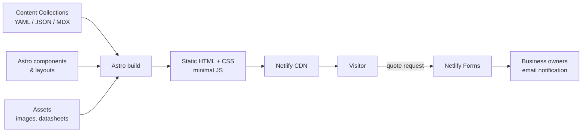
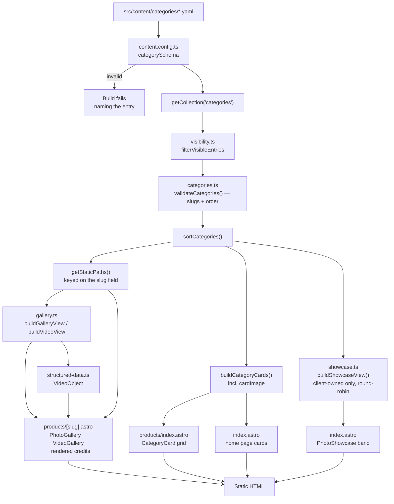

# Era-Sure Renewables Website — Architecture Documentation

## 1. How to Read This Document

This document is the architectural reference for the Era-Sure Renewables website: a
product-capability and lead-generation site for a renewable-energy and electrical
equipment supplier.

**Status: mostly real.** As of v0.12.0 the repository holds the scaffold and layout shell,
the `products`, `categories` and `deliveries` collections, the cables catalogue routes, the
products overview and six category landing pages with client photograph galleries and
self-hosted video, a measured brand palette, a sales-led home page, About and Contact, the
SEO surface (§13), and a Netlify-backed quote form with upload and success route. Delivery
proof routes are built but draft-only until approved photographs arrive. `brands` and
`faqs` remain **target architecture** rather than observed code.

**v0.6.0 reversed a founding assumption** — the client questionnaire contradicted the
original premise that the catalogue is the content (§2). Where an older section still
assumes a catalogue-first site, it is wrong and should be corrected on sight.

Sections marked **(planned)** describe intent; remove the marker once the code exists.
§22 lists decisions still open.

**Intended audience**: any developer planning, implementing or reviewing a change to this
site. Read it before changing the code. Routine content edits (text, photographs, delivery
highlights) need none of it: they go through Pages CMS, described in the README.

---

## 2. Overview

### Purpose

Era-Sure Renewables supplies renewable-energy equipment and the electrical products used
around it. The website exists to convert trade visitors — solar installers, EPC
companies, electrical contractors, wholesalers, and commercial/agricultural/industrial
buyers — into **qualified quote requests**.

Two things follow from that, and they shape every architectural decision below:

1. **The enquiry is the product.** The single most important action on the site is
   reaching Mitchell or Wesley — through a structured quote request, or directly by phone or
   WhatsApp. The enquiry journey is a first-class subsystem, not a contact page
   afterthought.
2. **The catalogue is *not* the content.** A visitor is not here to specify a cable
   unaided. What structured data the site does hold must still be correct, because wrong
   technical data on a supplier's site is a commercial and safety liability (§5.2) — but
   it is supporting material, not the site's purpose.

**Point 2 is a reversal made in v0.6.0**, and the reasoning matters because the opposite was
held for five releases. The client questionnaire ticks only three of
twelve website goals — generate quote requests, encourage phone/WhatsApp enquiries, attract
new trade customers. "Present the cable range clearly", "share product specifications /
datasheets", "help customers identify the right product", searchable catalogue, filters and
comparison tables are **all unticked**. In the client's words: *"Don't focus on the
technicals of each product — it should provide a '1000ft' view of what products we can
supply."*

The site therefore leads with **six product categories as capability**, taken literally from
the questionnaire: cables, cable management, switchgear and components, enclosures and
custom AC/DC combiners, electrical consumables, renewable energy equipment. Cable routes
survive as supporting pages, not as the organising principle. Supply-and-delivery highlights
supply proof without describing Era-Sure as the installer, and stay out of production until
permission-gated entries exist.

### High-Level Architecture

A **statically generated, content-driven site**. Content pages render to plain HTML at build
time from typed collections; the browser receives almost no JavaScript. Enquiries go to an
external form provider, so there is no runtime backend to operate, secure or pay for.



---

## 3. Technology Stack

Versions below are **pinned exactly** in `package.json` and were verified against the npm
registry at scaffold time (2026-08-05). Exact pins, not ranges: this is a small project
where a surprise minor bump is more expensive than a deliberate upgrade.

| Layer | Technology | Pinned | Rationale |
| --- | --- | --- | --- |
| Framework | Astro | 7.1.6 | Static-first, zero JS by default. The site's value is being found on Google and loading fast on mobile data. |
| Language | TypeScript | 6.0.3 | `strict` mode via `astro/tsconfigs/strict`. |
| Content | Astro Content Collections | built-in | Typed, validated content whose loader abstraction doubles as the CMS-migration seam (§8). |
| Schema validation | Zod | 4.4.3, via `astro/zod` | Invalid content fails the build. **Import from `astro/zod`** — `astro:content`'s `z` is deprecated in Astro 7, and a direct `zod` dependency needs a pin kept in step with Astro's and can drift into two copies. |
| Styling | CSS with design tokens | — | §11. No CSS framework; the visual language is narrow and bespoke. |
| Typeface | `@fontsource-variable/ibm-plex-sans` | 5.3.0 | Self-hosted, latin subset (44.6 KB). Chosen partly for tabular figures (§11). |
| Sitemap | `@astrojs/sitemap` | 3.7.3 | Built from the same static route graph as the build (§13). |
| Forms | Netlify Forms | — | No backend to secure; spam filtering and upload included. Isolated behind one component so the provider is replaceable (§12). |
| Hosting / CI | Netlify | — | Static hosting, atomic deploys, deploy previews and the form backend in one platform. |
| Linting | ESLint | 10.8.0 | Flat config. |
| | `eslint-plugin-astro` | 3.1.0 | |
| | `typescript-eslint` | 8.66.0 | |
| Formatting | Prettier | 3.9.6 | Formatting is not a review topic. |
| | `prettier-plugin-astro` | 0.14.1 | |
| Type checking | `astro check` (`@astrojs/check`) | 0.9.10 | Type-checks `.astro`, `.ts` and content-collection usage together. |
| Unit testing | Vitest | 4.1.10 | Shares Astro's Vite config via `getViteConfig()`; no separate toolchain. |
| E2E testing | Playwright | 1.62.1 | Chromium only. The enquiry journey, accessibility and the sentinel guard (§18). |
| Accessibility testing | `@axe-core/playwright` | 4.12.1 | Runtime WCAG scanning; substitutes for the unavailable a11y linter (§15). |

### Version Constraints Worth Knowing

These are not arbitrary pins — each is forced, and changing one breaks something:

- **TypeScript is held at 6.0.3, not the latest 7.x.** `@astrojs/check` peers
  `^5 || ^6` and `typescript-eslint` peers `<6.1.0`. 6.0.3 is the only version satisfying
  both. Bumping TypeScript without checking these two will break `npm run check`.
- **ESLint must be ≥ 10.** `eslint-plugin-astro@3.1.0` peers `eslint >=10.0.0`, so the
  ESLint 9 line is not an option while that plugin is used.
- **`eslint-plugin-jsx-a11y` is deliberately absent.** Its latest release still peers
  ESLint 3–9, making it a hard `ERESOLVE` against ESLint 10. It is an *optional* peer of
  `eslint-plugin-astro`, so omitting it is supported — but the plugin's `jsx-a11y-*`
  configs delegate to it and must not be referenced, or config loading fails. Accessibility
  is instead enforced at runtime by axe (§15).

**Runtime**: Node.js **24.19.0**, pinned identically in `.nvmrc`, `package.json`
`engines`, `netlify.toml` `NODE_VERSION` and the README. The binding floor is
`eslint-plugin-astro`'s `^24.16.0`, which is stricter than Astro 7's own `>=22.12.0` —
so Astro's requirement is not the one to check when upgrading. Build tooling only;
nothing runs on a server in production.

---

## 4. Project Structure

Established by the v0.2.0 scaffold. Directories marked *(empty)* exist with a `.gitkeep`
and are the committed home for work that has not landed yet.

The **full file-level tree is in [`README.md`](../README.md)** and is not duplicated here.
This section records what each directory is *for*, which is the part that constrains design
decisions.

| Path | Holds | Notes |
| --- | --- | --- |
| `docs/` | Developer documentation | This file, `popia-processing-facts.md` (§20), and `handover/` (the owner's editing guide) |
| `e2e/` | Playwright specs (`*.spec.ts`) | accessibility (§15), conversion-path (§12), seo (§13), sentinel-leak (§7), smoke |
| `public/` | Served verbatim, **untransformed** | `datasheets/` (§14), `video/` (§8, §14), `favicon.svg`, `og.png` |
| `scripts/` | Client-media conversion | PowerShell authoring tools, **never build steps** (§14) |
| `src/assets/` | Images through Astro's pipeline | `brand/`, `categories/`, `photography/`, `products/` (empty) (§14) |
| `src/components/` | By **feature area**, not size tier | `brand/`, `catalogue/`, `deliveries/`, `enquiry/`, `layout/`, `seo/`, `ui/` (§9) |
| `src/content/` | Collection entries + `README.md` editing guide | `products/`, `categories/`, `deliveries/` built; `brands/`, `faqs/` empty (§8) |
| `src/lib/` | Framework-free logic — the unit-tested core | `catalogue/`, `config/`, `deliveries/`, `enquiry/`, `navigation/`, `seo/` |
| `src/pages/` | File-based routing | `about/`, `cables/`, `contact/`, `privacy/`, `products/`, `quote/`, `deliveries/`, `robots.txt.ts`, `index.astro`, `404.astro` (§10) |
| `src/styles/` | `tokens.css` (§11), `global.css` — reset and typography base only | |
| `src/site.config.ts` | Business facts, one home (§7) | |

Root config: `.nvmrc`, `astro.config.mjs`, `eslint.config.js`, `netlify.toml` (§20, §21),
`playwright.config.ts`, `tsconfig.json`, `vitest.config.ts`, `package.json` (version of
record, §6).

**Still empty**: `src/content/{brands,faqs}/` and `src/assets/products/` — each the
committed home for a subsystem not yet built.

Two co-location decisions worth knowing: delivery photographs live beside their YAML entry
under `src/content/deliveries/`, so editorial data, permission state and source images are
reviewed together; and `src/components/enquiry/` holds both `SalesContactCard` and the
provider-contained `QuoteForm`, because direct and structured contact are one journey.

### Structural Rules

- **`src/lib/` holds no Astro imports.** It is plain TypeScript, so it is directly unit
  testable without a rendering harness. Any logic worth testing belongs here rather than
  inside a component. This is the single most important structural rule in the project.
- **`src/content/` holds data, never presentation.** No HTML, no styling decisions, no
  layout hints in content files.
- **`public/` versus `src/assets/`**: `public/` is for files that must keep a stable,
  linkable URL and must not be transformed — manufacturer datasheets above all.
  `src/assets/` is for images that should be optimised and hashed by the build.

---

## 5. Core Architecture Principles

1. **Static by default; interactive by exception.** A page ships JavaScript only when a
   feature cannot work without it.
2. **Content is typed and validated at build time.** A missing voltage rating fails the
   build. Wrong technical data on a cable supplier's site is a commercial and safety
   liability, so it must never be a runtime surprise.
3. **Logic lives outside components.** Components render; `src/lib/` decides. This keeps the
   testable surface framework-independent.
4. **External dependencies are isolated behind one seam.** The form provider and the content
   source are each reachable through a single module (§8, §12).
5. **No unverifiable claims.** Certifications, standards compliance, distributor status and
   photograph provenance all render from fields that exist only when the client or the source
   has supplied backing. **The schema makes an unsupported claim awkward to express.**
6. **Progressive enhancement.** The quote form submits without JavaScript; client-side
   validation is never the only validation.
7. **Business facts have one home** — `src/site.config.ts`, never typed into a template.

---

## 6. Build System & Toolchain

### Commands

```bash
npm install          # install dependencies
npx playwright install chromium   # one-time; NOT covered by npm install
npm run dev          # local dev server with HMR (default: http://localhost:4321)
npm run build        # production build to dist/
npm run preview      # serve dist/ locally, as the CDN would
npm run lint         # eslint .
npm run format       # prettier --write .
npm run format:check # prettier --check . — non-mutating, for verification passes
npm run check        # astro check — type-check components, content and TS
npm test             # vitest run
npm run test:e2e     # playwright test (builds first, then serves dist/)
```

Two prerequisites are **not** covered by `npm install`: the Node version (24.19.0, see §3)
and the Playwright browser. Both are stated in the README because both fail confusingly
when missing.

`npm run format` deliberately skips `docs/` (`.prettierignore`): those are
hand-wrapped documents, and reformatting them would produce large diffs unrelated to
whatever change is in flight.

### Build Pipeline

`npm run build` → load content collections → **Zod validation** (invalid data fails the
build with a field-level error, never warn-and-continue) → generate routes from entries →
render `.astro` to HTML → optimise images to WebP/AVIF with responsive sets → bundle CSS and
any island JS → `dist/`.

### Version of Record

`package.json` `version` field. It is the single source of truth for the project version
and is bumped with each developer release. Content edits made through Pages CMS do not
change it.

---

## 7. Configuration

The site has no runtime configuration — everything is resolved at build time. There are
three distinct configuration surfaces, and mixing them is a review finding.

| Surface | File | Contains |
| --- | --- | --- |
| Framework | `astro.config.mjs` | Site URL, integrations, image service, build options. |
| Business facts | `src/site.config.ts` | Registered and display names, registration and VAT numbers, tagline, **`salesContacts[]`**, sales and accounts email, business hours, **`responseTime`**, social links, service areas. Typed and imported wherever displayed. |
| Build-time secrets | Netlify environment variables | Only if an integration later requires a key. None at present. |

**No secrets in the repository.** The site is fully static, so any committed value is public
by definition; Netlify Forms was chosen partly because it needs no API key at all.

`site.config.ts` matters more than it looks: the questionnaire flags contact details as what
visitors rely on most, and a wrong phone number duplicated across six templates is the
classic way that goes wrong.

### Two Direct Contacts, Not One

`SiteConfig` holds **`salesContacts: SalesContact[]`** — `id`, `name`, `role`, `region`,
`hub`, `phone`, `whatsapp` — because the business is two brothers covering two provinces,
each with their own number. A single `phone`/`whatsapp` pair could not express it.

**There is no `address`.** "Physical address" and "collection instructions" are both
unticked, and what the client supplied — `Sandton, JHB`, `Hillcrest, KZN` — are area names,
not postal addresses. They live on `SalesContact.hub` as service hubs. A registered address
for the POPIA and terms pages is outstanding and tracked on the pre-launch checklist, rather
than kept as a sentinel block that renders nothing.

`src/lib/config/phone.ts` owns `tel:`/`wa.me` normalisation, because the footer and the
home-page chooser both need it. Two copies would eventually disagree, and the disagreement
would be an unreachable sales contact.

### One Contact View Model, Not a Footer One

`src/lib/config/contact.ts` exports `buildContactDetails()`, renamed from
`buildFooterContent()` in v0.7.0 when `/contact/` became a second caller. **A module named
for its only caller is how a second copy gets written for the next one.**

Renaming it exposed confirmed facts rendering on no page at all, and a 60-minute response
promise that was a string literal in `index.astro` rather than config. **v0.12.0 found the
same defect again**: the 24/7 support claim was hard-coded on the home page and had already
diverged from `businessHours.supportNote`. Business facts drift the moment they have two
homes.

**`socialLinks` is where the three-kinds-of-unknown table below becomes load-bearing.** When
this builder was introduced, Facebook and Instagram were *absent keys*, not sentinels, so it
had to survive a missing property rather than merely filter a `TODO_CLIENT` string. **A
sentinel-only test passes against a builder that crashes on the real config.**

`responseNote` is composed here rather than in either page, and is emitted only when
**both** `responseTime` and `businessHours.weekdays` are confirmed. The sentence names the
hours it applies within, so an unscoped promise cannot reach a page while the 24/7 question
is open — one gate, one place to widen it if the client confirms.

### Placeholder Discipline

Most client details are now supplied. The rule still governs the remainder:

> Never replace a sentinel with a plausible-looking value. An invented phone number or
> address looks correct, fails silently, and costs the business a lead. Substitute only
> confirmed client detail.

`siteUrl` is the one exception to the sentinel *format*: Astro validates `site` as a URL and
an unparseable value breaks every Astro command, not just the build. It uses
`https://era-sure-renewables.invalid`, on the RFC 2606 reserved TLD that can never resolve.

`src/lib/config/placeholders.ts` reports the dotted key paths still holding either sentinel
form, and exports both `isPlaceholder` and the `TODO_CLIENT` constant so there is exactly
**one** definition of "placeholder" — two would drift, and the drift would surface as
`TODO_CLIENT` on a live page.

**What remains falls into three kinds of unknown, which are not interchangeable:**

| Kind | Values | Reported by `findPlaceholders`? |
| --- | --- | --- |
| `TODO_CLIENT` sentinel | `businessHours.saturday`, `businessHours.sunday` | Yes |
| Reserved non-resolving URL | `siteUrl`, still `.invalid` | Yes, as a special case |
| **Absent optional field** | Facebook — `socialLinks` carries the confirmed LinkedIn and Instagram profiles | **No** |

**The third row is the trap.** An absent optional field cannot be reported as outstanding,
because nothing distinguishes "not supplied yet" from "deliberately not used" — and adding a
sentinel to force it into the report would be worse, since the render-nothing-when-absent
behaviour would then depend on a value that must never render. Absent optional fields go on
the pre-launch checklist instead.

`findPlaceholders` only reports; the build-time gate is the pre-launch feature's job (§22
#5). The actual guard is `e2e/sentinel-leak.spec.ts`, which scans every built HTML **file on
disk**. Scanning files rather than pages extends coverage to new routes automatically and
catches sentinels in meta tags, attributes and hrefs that never appear in visible text.

### `displayName` versus `tradingName`

These are two different facts and must not be merged:

| Field | Status | Used for |
| --- | --- | --- |
| `displayName` | **Confirmed** — "Era-Sure Renewables" | The visible brand name: header, footer, page titles |
| `tradingName` | **Confirmed in v0.6.0** — "Era-Sure Trading (Pty) Ltd" | The *registered legal* name, for POPIA and terms pages and invoices |

The distinction exists because the header needs a name to render, and using `tradingName`
would have leaked a sentinel into every page's masthead while the legal name was unknown.

**Keeping them separate mattered more than expected.** The client's Instagram suggested the
registered name was "Era-Sure **Renewables** (Pty) Ltd"; that guess was recorded as a
candidate rather than adopted, and it was wrong — the entity is "Era-Sure **Trading** (Pty)
Ltd". A plausible-looking value that reads perfectly would have gone onto a POPIA notice,
which is exactly the failure the sentinel rule prevents.

**Phone and WhatsApp storage contract**: one field per number, stored in full international
human-readable form (e.g. `+27 21 555 0100`). That is the display value; `src/lib/config/
contact.ts` normalises it for links — `tel:` keeps the leading `+`, `wa.me` takes digits
only. Do not add separate display/link fields; that duplicates a fact and the two would
drift.

---

## 8. Content Architecture

**`products`, `categories` and `deliveries` are real**; `brands` and `faqs` are still
empty directories. `deliveries` has only a draft visual example until client photographs
and publication permission arrive.

### Collections

Defined in `src/content.config.ts` with Zod schemas and Astro content loaders.

| Collection | Format | Purpose |
| --- | --- | --- |
| `products` | YAML | **Built.** Product groups with structured technical specifications. |
| `categories` | YAML | **Built.** Six category landing entries driving `/products/`. |
| `deliveries` | YAML + local images | **Built.** Supply-and-delivery proof driving a conditional listing, detail routes and homepage previews. |
| `brands` | YAML | *(planned)* Brand name, logo, permission-to-display flag, related products. |
| `faqs` | MDX | *(planned)* Questions the business answers repeatedly. |

Adding any MDX collection requires `@astrojs/mdx`, which is not yet installed
(`@astrojs/mdx` 7.x declares a compatible `astro ^7.0.0` peer).

**`categories` is YAML, not the MDX this section originally specified.** Its content is
enumerable lists plus two short paragraphs, none needing inline formatting. MDX would have
meant an integration for no formatting benefit while burying filterable data in prose. It
can gain an MDX body later without disturbing the structured fields.

**`typicalVariants` is optional, deliberately.** Requiring it produced entries where it
merely restated `sourceItems`, because only some categories came with genuine variant
detail. A required field satisfiable only by duplication or invention is a schema pushing an
editor toward making things up — the opposite of §5.5.

**`headline` and `rangeHeading` are optional, and separate from `name`.** `name` is the
short label cards, breadcrumbs and related-range links need; `headline` is the page's h1 in
the words buyers search ("Cable trays, ladders and trunking" rather than "Cable
management"). `rangeHeading` replaced a slug-keyed ternary in the page template. Both fall
back — to `name` and to "The range includes" — so an entry without them still renders.

**`categories` carries its own media as of v0.11.0**: optional `cardImage`, `gallery` (1–30,
each with non-empty `alt`), `videos` (1–6), and the `galleryHeading`/`galleryIntro` pair, all
validated through Astro's `image()`. This replaced **two hard-coded maps inside components**,
violating §9's already-shaped-data rule. The trigger was operational: the client sends
photographs a category at a time, so every future batch would otherwise be a component edit.

**`galleryHeading`/`galleryIntro` exist for a claims reason, not a styling one.** Licensed
stock must not imply Era-Sure supplied what is pictured (§5.5); the company's own
photographs can describe its supply work. Absent, `buildGalleryView` falls back to
wording that claims neither. The slug-keyed ternary this replaced had already gone stale,
calling real client photographs "illustrative examples".

As of 2026-09-21 all six categories use client photographs. The neutral fallback and
third-party credit support remain available for future content.

**`videos[].src` points into `public/`, not through `image()`** — the pipeline does not
process video and a video needs a stable untransformed URL (§4). It is refined exactly like
`datasheetPath`: it must start with `/video/` **and** the file must exist, because a 404 on
a video is the same class of failure as a 404 on a datasheet (§17). The **poster** does go
through `image()`, applying the `og.png` lesson (§14) ahead of shipping rather than after.

**Published video carries no audio track.** `convert-client-videos.ps1` passes `-an`, so
site chatter — bystanders who gave no consent, occasionally a customer or a price — never
reaches the MP4. A §20 consent decision, not a taste one, and why the fix is `-an` rather
than `muted`: **a muted player still ships those words to anyone who saves the file.** The
player sets `muted` too, but only against a clip that arrived by some other route.

**`videos[].publishedOn` is a required editor-supplied `YYYY-MM-DD`**, validated by parsing
so `2026-02-31` fails. Deriving it from build time would let the same clip claim a new
publication date on every deploy.

**It reaches the schema as a datetime, not a date.** `buildVideoStructuredData` appends
`T00:00:00+02:00` — midnight SAST, the offset ZA has kept without daylight saving since
1944 — because Search Console faults a date-only `uploadDate` twice: "invalid datetime
value" and "missing a timezone". The editor still supplies a plain day; only the schema
boundary knows about clocks.

**It is structured data only** (v0.12.1). It became the `VideoObject` `uploadDate` (§13)
*and* rendered as a visible `Published <date>` line under each clip; the visible half is
gone. A fixed date under every video ages the page for as long as nobody shoots new footage,
which on a supplier site is most of the time — the page looked stale while the business was
not. The machine-readable date has no such cost, so it stays. `formatPublishedOn` and the
`publishedLabel` view field were deleted with the markup rather than left as unused
plumbing, and an e2e assertion holds the `<time>` element at zero so its return is a
decision, not an accident.

**Every gallery photograph carries a required `provenance` (v0.12.0)** — `client-owned` or
`third-party` — with a structured `credit` object (`creator`, `title`, `sourceUrl`,
`license`, `licenseUrl`, `modification?`) required when, and permitted only when, the value
is `third-party`. URLs validate as URLs.

The trigger was the home-page showcase band (§9), which states Era-Sure supplied the
equipment pictured. Nothing in the build could tell whether that was true: four of the six
galleries carry licensed stock, three of it ShareAlike, and that fact lived only in
`THIRD_PARTY_IMAGES.md` — a file the build never reads, backing attribution that rendered on
no page at all.

**Required with no default is the design.** The first draft made `credit` optional and read
its *absence* as a claim of ownership — exactly what this section already rejected for
`status`. Here the omission is worse than an unpublished entry: one forgotten backfill puts a
ShareAlike photograph under a supply claim with no error anywhere. **Silence must not be able
to assert anything**, so `buildShowcaseView` matches the positive value and never tests for
an absent field.

The refinement runs in **both directions**. Requiring a credit on a third-party photograph is
the obvious half; *rejecting* one on a client-owned photograph is the half that stops a stale
credit surviving a provenance correction and attributing a work nobody licensed.

**`categories` has no `logo` or brand-permission field.** Logos require recorded display
permission (§20), none has been given, and "promote selected brands" is unticked — text-only
names sidestep the question entirely. A `brands` collection with a permission flag remains
the right shape if logos are ever wanted.

### Validation Beyond Field Types

Three rules in the `products` schema are **refinements**, not field types, because each has
a silent failure mode a plain type would miss:

| Rule | What a plain type would allow |
| --- | --- |
| Required strings non-empty (`.trim().min(1)`) | `z.string()` accepts `""` — a product publishes with an empty `<h1>` and passes validation. A blank string is not a missing value. |
| Temperature endpoints paired, `min <= max` | A one-sided range reaches the formatter, which promises a *range* and must invent a display for half of one. |
| `datasheetPath` starts with `/datasheets/` **and** the file exists | ARCHI §17 requires the build to fail on a missing datasheet; a 404 on a technical document is worse than a build failure. This is the one place a schema touches the filesystem, justified because `content.config.ts` runs in Node at build time. |

**Slug uniqueness is necessarily *not* a schema rule.** Zod validates one entry at a time
and cannot see siblings, so `assertUniqueSlugs()` takes the whole collection and runs before
paths are generated. Without it `getStaticPaths()` emits duplicate routes and one entry
silently overwrites the other. `validateCategories()` adds **unique `order`**, and
`validateDeliveryHighlights()` applies both to `deliveries`. **Every consuming page calls
these before sorting or mapping** — an assertion that exists but is never invoked is worse
than none, because its unit tests manufacture confidence.

The `deliveries` schema additionally requires 1–8 images with non-empty alt text and rejects
`status: published` unless `publicationPermission` is `confirmed`, making permission a build
contract rather than a note an editor can overlook.

**`category` is `z.literal('cables')`, not an enum.** Every cable-specific field is
mandatory, so an enum admitting `panels` would be a lie — such an entry could never validate.
The literal makes an unroutable product *impossible* rather than merely unlikely. A wider
range arrives as a **discriminated union**, paired with its routes in the same feature.

### The Structured / Prose Split

**Structured fields (YAML/JSON)** are anything a visitor might filter, compare or sort on,
or that appears in a specification table — conductor material, mm², core count, voltage and
current rating, temperature range, materials, colours, lengths, standard, datasheet path,
lead time, minimum order. **Prose (MDX)** is anything read in sequence: category
introductions, selection guidance, application notes.

**Structured data must never be buried in prose.** A voltage rating written into a paragraph
cannot be filtered, compared, validated, or emitted as structured data for search engines.

### Schema Design for CMS Migration

The schema is designed so a later move to a headless CMS is a **loader swap, not a
rewrite**. Three rules make that true:

1. **Flat, primitive-friendly fields.** Prefer named scalar fields over deeply nested
   structures; CMS field types map cleanly onto scalars and shallow objects.
2. **Stable string IDs.** Every entry carries an explicit `id`/`slug` field that is never
   derived from a filename, so identity survives a move out of the filesystem.
3. **Relations by ID, not by file path.** A product references a brand by its brand ID.
   Path-based references break the moment content leaves the repo.

The consequence: `src/content.config.ts` swaps its `loader` from `glob()`/`file()` to a CMS
loader, and the schemas plus every `getCollection()` call site remain untouched.

### Content Ownership and the Draft Guard

**Placeholder specifications and unapproved photographs must never reach production** —
wrong data is a commercial and safety liability, and publishing identifiable project
material without permission is a privacy failure (§5.2, §20).

The mechanism, settled in v0.4.0:

- Every entry carries a required **`status: 'draft' | 'published'`** with **no default**.
  A default would let an entry become publishable by omission.
- `src/lib/catalogue/visibility.ts` filters by build context, read from
  **`process.env.CONTEXT`**. Not `import.meta.env.CONTEXT` — Vite only exposes prefixed
  variables there, so it would read `undefined` and silently disable the guard, which is
  the precise failure being guarded against.
- The filter is generic (`filterVisibleEntries`) over any entry carrying `status`, with
  `filterVisibleProducts` retained as a typed wrapper. **One implementation, one set of
  tests** — a second copy of the production draft guard is exactly the divergence that
  publishes placeholder content.
- Drafts render in dev and Netlify deploy previews; production ships published entries
  only.

**The consequence is deliberate**: with no client specifications or approved delivery
entries yet, the production catalogue is empty and `/deliveries/` redirects home. That is
correct — the alternatives are invented cable ratings or placeholder project claims.

**The six `categories` entries are `published`**, because their content came from the
client's own questionnaire answers rather than being invented. The draft guard protects
against fabricated data, not against all new content.

`src/content/README.md` is the editing guide, and states the rule the guard serves:
specification values come from the client or a manufacturer datasheet, never an estimate.

---

## 9. Components & UI Architecture

All five areas are now real. `deliveries/` owns the delivery card, while `enquiry/` owns
the contact card and quote form (§12).

Components are organised by **feature area**, not by generic size tier. `catalogue/`,
`deliveries/`, `enquiry/`, `layout/` and `ui/` mirror the way work actually arrives: a
change is nearly always to the catalogue, proof content, enquiry journey, or shell.

### Conventions

- `.astro` components by default. A framework island is introduced only when a feature
  needs client-side state that plain HTML plus a small script cannot express reasonably.
- Props are explicitly typed via a `Props` interface in every component.
- Components receive **already-shaped data**. A component does not call
  `getCollection()`, filter, or sort — the page does that (via `src/lib/`) and passes the
  result down. This keeps components rendering-only and testable logic in one place.
- Presentational state stays local; there is no global client state, because there is
  almost no client.
- **A component whose depth varies by caller takes `headingLevel` as a prop.**
  `CategoryCard`, `SalesContactCard`, `PhotoGallery` and `PhotoShowcase` all do: the same
  card is an `h2` under a page `h1` and an `h3` under a section heading. Axe reports only
  *skipped* levels, never wrong ones, so nothing catches this automatically and the caller
  must be explicit.
- **A component never owns an `id` that a page points at.** `PhotoShowcase` takes its
  `headingId` as a prop because the page's `Section` references it with `aria-labelledby`;
  owning the literal internally would put the two halves of one reference in different
  files, where a rename breaks it silently.

### Key Components

All are built. `CableFilter` is the only one ever specified and then dropped.

**Shell** (`layout/`, v0.3.0):

- `SkipLink` — WCAG 2.4.1 bypass link, hidden until focused.
- `Header` — banner landmark and wordmark; renders `displayName`, never `tradingName`.
- `Nav` — navigation landmark, `aria-current="page"`, and the mobile disclosure: an
  off-canvas drawer with backdrop, close button and document scroll lock below 48rem.
- `Footer` — contentinfo landmark, rendering only confirmed contact groups (§7). It receives
  **the same shaped nav array as `Nav`**, so deep-scroll visitors get a second route to every
  page without a second source of navigation truth.
- `Breadcrumbs` — renders a supplied trail, and nothing below two entries.
- `FloatingWhatsApp` — fixed shortcut carrying WhatsApp's own mark rather than a redrawing
  of it: an approximation reads as a generic chat bubble at 32px, and Meta's brand guidance
  asks that the logo not be recreated. Only the fill departs from the brand sheet, for the
  contrast reason in the token comment — the bright `#25d366` measures 1.98:1 under a white
  glyph, against 4.14:1 for the green actually used, so the recognisable colour is the one
  that fails. A label reads **`Get a quote on WhatsApp`**, revealed on hover and keyboard
  focus at `48rem` and up and absent below it: pinned open, it covers roughly 60% of a 375px
  viewport for the whole session, over the catalogue copy it exists to support. The label is
  positioned out of flow so the resting hit area stays the circle and swallows no taps meant
  for the page beneath. Its accessible name is business-level rather than person-level and
  repeats the visible words verbatim (WCAG 2.5.3), and it receives an already-shaped
  `SalesContactLink`, so the component never owns a phone number and disappears when one
  cannot be built from confirmed configuration.

**Feature components**:

- `SpecTable` — specification rows, omitting absent fields rather than showing blanks. A real
  `<table>` inside a focusable `role="region"` that scrolls horizontally so the page does not
  (§11).
- `ProductCard` — receives pre-formatted strings and does no unit handling.
- `CategoryCard` — maps the stable slug to one of six decorative SVG icons, with the brand
  mark as a safe fallback for a future unmapped category.
- `DeliveryHighlightCard` — uses an **empty alt** deliberately, because its linked title and
  summary already name the destination; the detail page uses the meaningful source alt.
- `SalesContactCard` — one direct contact with its `wa.me` and `tel:` links, on `/`,
  `/about/` and `/contact/`.
  **It declares its own text and link colours alongside its background**, which is not
  cosmetic. As inline markup on a default surface it could inherit safely; as a component it
  can be dropped into an inverted `Section`, where `--color-link` is re-pointed to the lime —
  9.03:1 on that band, **1.76:1** on the card's white fill. **An element that owns a
  background owns its foreground** (§11).
- `PhotoGallery` — **built in v0.11.0.** Replaced two ~80%-identical showcase components
  that carried two copies of one lightbox and two colliding `id` values, safe only because
  no page rendered both. Takes a `GalleryView` from `src/lib/catalogue/gallery.ts` plus an
  `idPrefix`, so two galleries on a page cannot collide. Square mosaic with a lightbox
  carrying previous/next, an `aria-live` counter and focus restoration. Since v0.12.0 it also
  renders third-party **credits** beneath the grid (§14).
  **Both tile minimums are derived, and one figure cannot serve both ends**: three columns in
  the ~288 px a 320 px viewport allows needs ~90 px tiles, so a 9rem minimum collapses to a
  *single* column there, while an unbounded 5.5rem packs about twelve tiles into a desktop
  container. Hence `minmax(5.5rem, 1fr)` below 48rem and `9rem` above.
- `PhotoShowcase` — **built in v0.12.0.** The home page's photographic band: a
  `ShowcaseView` from `src/lib/catalogue/showcase.ts` rendered as a lazy `<Image />` mosaic,
  two columns then four from 48rem. **Three is skipped deliberately** — the band carries
  eight photographs, and a three-column step leaves a ragged 3-3-2, the same orphan defect
  v0.12.0 removed from the home page's procurement grid.
  **It ships no JavaScript, and that constrained the design.** Tiles are plain images, not
  links and not lightbox triggers: a linked tile would need an accessible name distinct from
  its alt text and would duplicate the category grid directly above it, and a lightbox would
  have been a third script (§19). A photographic band needs neither.
- `VideoGallery` — self-hosted `<video controls preload="none" poster>` with **no JavaScript
  at all**. Its `width`/`height` come from the poster's intrinsic dimensions rather than a
  typed constant: the client's clips are portrait (406×720), and a hard-coded 16/9
  letterboxes them while reserving the wrong space — the exact layout shift those attributes
  exist to prevent. **Derive dimensions from the asset.** Both this component and
  `ValuePropositionVideo` use those attributes and the poster for their aspect ratio; inline
  style attributes are blocked by the production CSP. Since 2026-09-21 the home page
  no longer renders `ValuePropositionVideo` or its `VideoObject`; the desktop column
  beside the value proposition stays blank at the client's request. Category videos remain.
- `QuoteForm` — the progressive Netlify form: honeypot, confirmed field set, optional
  bill-of-quantities upload, success-route action. **The only component containing
  provider-specific form markup** (§12).
- `StructuredData` — a rendering-only bridge from the SEO builders into escaped
  `application/ld+json`. It makes no schema decisions; `src/lib/seo/structured-data.ts` owns
  those and is unit tested.
- `CableFilter` — **dropped, not deferred.** Filtering, search and comparison tables are all
  unticked in the questionnaire; building it would be building something nobody asked for.

### Browser Scripts and Progressive Enhancement

The site ships **three** small bundled scripts and no framework runtime. JSON-LD uses
non-executable script data blocks.

| Script | Why it cannot be plain HTML |
| --- | --- |
| Nav toggle (v0.3.0) | An accessible disclosure needs a real `<button aria-expanded>`; a CSS-only checkbox or `<details>` announces incorrectly. |
| Photo gallery (v0.11.0) | The lightbox tracks which photograph is open and moves between them; a `:target` lightbox cannot do previous/next with focus management or restore focus on close. |
| Quote attachment guidance (audit branch, 2026-09-08) | Rejects files above 7,500,000 bytes before upload, with a linked email alternative and a live error message. The native POST form remains usable without JavaScript. |

**This section said "the one script" until v0.11.0** and was already wrong — a second script
had shipped without a plan. Recorded because a document that quietly stops describing the
code is worse than one that admits growth. v0.12.0 added a photographic band and kept the
count at two, deliberately (§9, `PhotoShowcase`).

The menu also traps keyboard focus while open, exposes dialog semantics only in that state,
and includes a mobile quotation link. Three rules govern these scripts:

1. **A plain Astro `<script>`, never `is:inline`, with `vite.build.assetsInlineLimit: 0`.**
   Astro inlines small scripts by default and the production CSP blocks inline scripts —
   but `astro preview` applies nothing from `netlify.toml`, so **the failure is invisible
   until deployed** (§20).
2. **Base CSS must render content visible; collapse is applied only after init.** Were
   collapse the CSS default, a blocked script would permanently hide the navigation, or most
   of the client's photographs. The gallery obeys this twice: its disclosure button is
   server-rendered `hidden` and revealed only *after* listeners bind, so a control can never
   appear before it works; and its thumbnails are **`<a href>` links, not `<button>`s**,
   upgraded by `preventDefault()`. A server-rendered button whose only behaviour comes from
   JavaScript is dead markup when the script fails; an anchor still opens the photograph.
3. **`visibility` is switched, never transitioned, and never mirrored into `aria-hidden`.**
   A `transition: visibility 200ms` makes the computed value lag the state change in *both*
   directions: opening, `close.focus()` ran while the panel still computed as `hidden` and
   silently did nothing; closing, `aria-hidden="true"` applied while the panel was still
   visible, leaving focusable links inside an `aria-hidden` subtree. The drawer sets no
   `aria-hidden` at all — `visibility: hidden` already removes the subtree from the
   accessibility tree and tab order. **State the stylesheet owns must not be duplicated into
   ARIA.**

---

## 10. Routing & Page Structure

File-based routing under `src/pages/`. Everything in the table below is built except the
last row.

**Navigation links come from `src/lib/navigation/nav.ts`, which lists only routes that
exist.** A link is added there in the same feature that creates its route, never before —
so a broken link cannot ship, and the nav grows with the site rather than pointing at
intentions.

### Route Identity Versus Nav Visibility

`nav.ts` separates two things that look like one:

| Export | Contents | Consumer |
| --- | --- | --- |
| `routeLabels` | **Every** known route and its label, unconditional | `breadcrumbs.ts` |
| `buildNavItems()` | The **visible subset** | `BaseLayout` → `Header` → `Nav`, as a prop |

Visibility is a property of the nav, not of a route's identity. Coupling them would make a
breadcrumb on `/cables/foo/` lose its label in production — exactly where the nav item is
hidden.

**`/privacy/` is the third route to use this split**, after `/cables/` and `/deliveries/`,
and the clearest case for it: a legal notice belongs in the footer and at the point of
collection, not in a four-item primary nav — but its breadcrumb must still resolve. It is
`routeLabels`-only, and `nav.test.ts` asserts both halves of that.

**`/cables/` left the visible nav in v0.6.0**, hidden unconditionally: the client did not ask
for a product catalogue and every product entry is a draft. Its `routeLabels` entry survives,
so a breadcrumb on `/cables/foo/` still resolves — the whole point of keeping identity
separate from visibility.

**The visible nav is `Home`, `Products`, `About` and `Contact`**, with Request a Quote as the
persistent header CTA rather than a fifth text link. On small screens the open menu is a
vertical list of full-width 48px touch targets. Delivery highlights have route identity for
breadcrumbs but stay out of the nav until real entries are approved.

`BaseLayout` passes the same shaped array to both shell landmarks as a **prop**, not an
import. Neither `Nav` nor `Footer` reshapes route data, so their links cannot drift apart.

**The primary CTA follows the same rule**, via `src/lib/navigation/cta.ts`. It returns
`null` when there is no honest destination — which is not decoration: with no reachable
contact, `/contact/` renders an empty state, and a button pointing at "details are being
confirmed" is worse than no button.

**The primary CTA resolves to `/quote/`**; direct WhatsApp and phone remain on `/contact/`,
so a visitor chooses between a structured request and a quick conversation.

One lesson from its history is worth keeping: before `/contact/` existed the CTA pointed at
an **absolute** `/#sales-contacts`, and it had to be absolute because the same button renders
on six category pages, where a bare fragment resolves against `/products/[slug]/` and matches
nothing — a dead primary CTA on every category page, with no error anywhere. **A CTA aimed at
a section of a different page is the defect**; the absoluteness was only its symptom. The
accepted trade-off is that the home hero button navigates rather than scrolling to the
chooser below it, which also makes the conversion target linkable. `e2e/conversion-path.spec.ts`
follows the CTA *from a category page*, because that is where a routing mistake is silent.

| Route | Source | Notes |
| --- | --- | --- |
| `/` | `index.astro` | Renewable-led positioning, direct contacts, showcase band, process and quote CTA. |
| `/products/` | `products/index.astro` | The six categories as capability, with the quote-based pricing note. |
| `/products/[slug]/` | dynamic from `categories` | Six category landing pages. Breadcrumbs render here. |
| `/cables/`, `/cables/[slug]/` | `cables/`, dynamic from `products` | **Out of the nav.** Listing renders a designed empty state when nothing is publishable; detail pages carry the full specification table. |
| `/about/` | `about/index.astro` | Positioning, regional contacts, registered details. Claims traceable to the questionnaire; no photographs, testimonials or partner names. |
| `/contact/` | `contact/index.astro` | The conversion destination: both contacts, email routing, hours, socials, service hubs. **No map, no address, no collection instructions.** |
| `/deliveries/`, `/deliveries/[slug]/` | `deliveries/`, dynamic from `deliveries` | **Conditional.** Listing redirects home when nothing is visible; one detail page per eligible entry. |
| `/quote/`, `/quote/success/` | `quote/` | The primary conversion page and its post-submission confirmation (§12). |
| `404` | `404.astro` | Links only to routes that currently exist — **a 404 whose recovery links 404 is worse than the original error.** |
| `/brands/`, `/resources/`, `/faq/`, `/legal/*` | — | *(planned)* Permission-gated brands, datasheets, FAQs, remaining policies. |

All rows above except the last are **built**. `netlify.toml` permanently redirects the
retired standalone solar-panel, inverter and battery category URLs to the renewable-energy
umbrella page, preserving links made during the renewable-led pass without maintaining a
second public category structure.

Dynamic routes are generated with `getStaticPaths()` from content collections, so adding
a product group creates its page automatically. Slugs come from the entry's explicit
`slug` field (§8), never from the filename — filenames may be reorganised; URLs must not
change, because URLs are what Google indexed.

---

## 11. Styling Architecture

The design **system** was settled in v0.5.0 and the **colour values** landed in v0.6.0.
That split is the point of the token layer: the palette swap changed one file and no
component, exactly as intended.

### Tokens

Colours, spacing, typography scale, radii and breakpoints are CSS custom properties in
`src/styles/tokens.css`.

**The palette is derived from the client's logo, not matched to it.** The logo PDF yields
teal `#0096b1` and lime `#7dd956`, and **neither is usable as an interface colour**: the
teal measures 3.50:1 on white (UI boundaries only, fails the 4.5:1 text floor) and the lime
1.76:1 (graphic only, fails even the 3:1 UI floor). With the client asking for *similar*
rather than matched, the task became designing a palette in the same family. Text and link
roles take derived values; the raw brand colours survive as **`--color-brand-*` tokens,
named so their restriction is visible at the call site** — graphic-only, and
`--color-brand-green` must never carry text or a border on a light surface.

**Every colour pair is measured, not estimated**, and this is not ceremony — it has caught
the same class of error twice. A v0.5.0 draft specified a border with a "≥ 3:1" requirement
beside a value measuring **1.63:1**; the v0.6.0 border was first drafted at `#7c939b`,
measuring **2.99:1** on muted and visually identical to the `#768d97` that replaced it.
Clear the threshold with margin, not by a hair.

| Requirement | Applies to |
| --- | --- |
| ≥ 4.5:1 | Body text, links, button labels |
| ≥ 3:1 | Borders, focus rings, other UI boundaries |

`--color-link` is defined as `var(--color-accent)` rather than repeating the value, so the
two cannot drift. `--color-link` and `--color-accent-contrast` are **live contracts**
consumed by `global.css` and `SkipLink.astro`; dropping either in a palette change leaves
the skip link on stale values — nothing visibly breaks, it just quietly falls below
contrast.

### Surface-Aware Tokens — a rule worth knowing before adding a variant

**When a component offers a surface variant, every token it or its children consume must be
checked against *that* surface, not just the default.** A variant that permits an unusable
combination is a latent bug the automated gate finds only by luck.

Three real cases, all the same shape:

- `--color-link` measures **2.25:1** on the inverted surface, so `Section` **re-points**
  `--color-link` and `--color-link-hover` in that variant. The section knows it is inverted,
  so the section fixes it.
- The secondary button was a fixed accent fill — legible text, but **2.25:1** against the
  inverted surface, so the control itself was invisible. It is now an outline in
  `currentColor`: correct on any surface **by construction** rather than by checking
  (16.32:1 light, 14.95:1 inverted).
- The primary CTA hit the same trap in v0.6.0. Its teal fill is **2.51:1** on the inverted
  surface (**1.75:1** hovered) while the white label stayed legible at 6.33:1 — the button's
  *shape* dissolved into the band while nothing looked broken. `Section` re-points
  `--color-cta`, `--color-cta-hover` and `--color-cta-contrast`, using the lime at 9.03:1.

The `currentColor` fix is the better shape: it removes the possibility of getting it wrong
rather than adding another value to remember. **Axe will not save you here** — it does not
evaluate a button's fill against the band behind it, and passed all sixteen routes with the
CTA invisible. Measure a filled control against every surface it can land on.

### Two Band Rules, Added in v0.12.0

Both are cheap to get wrong because nothing fails when you do.

**A card's fill must differ from the band it sits on.** `.proof-list li` and `.steps-list li`
were `--color-background` on `default` bands — white cards on white, visible only as a 1px
outline. The inverse case (white card on muted) sat correctly right next to them, which is
how the rule was noticed. Both pairings are already measured in `tokens.css`.

**No two adjacent bands may share a surface**, and **check the sequence in the production
build**: the deliveries band is draft-gated, so dev renders a band production does not, and
a sequence that alternates locally can collapse live. One consequence — the home page's
sequence assumes its *conditional* showcase band renders; below `buildShowcaseView`'s
minimum, categories and procurement become adjacent muted bands. Accepted rather than
cascaded, since making every later band's surface depend on a conditional one is worse than
a missing boundary in a state where the site has lost its photography.

### Brand Green on Light Surfaces

`--color-brand-green-deep` (#458f27) measures 4.03:1 on white and 3.73:1 on muted: it clears
the **3:1 UI floor** and fails the **4.5:1 text floor**, so it may carry rules, borders and
decorative graphics, never text. The `✓` in `.proof-list` stays teal for that reason — a tick
is a text glyph.

v0.12.0 applied it to the `CategoryCard` top rule, previously a `scaleX(0.35)` stub that only
completed on hover. **A hover-only brand cue appears for the fraction of a visit a pointer is
over the card, and on a touch device never at all.** Being decorative it carries no contrast
floor, so it is drawn full width at rest.

### Typography

**IBM Plex Sans**, self-hosted via `@fontsource-variable/ibm-plex-sans`, with the system
stack as fallback so a failed request degrades to the previous appearance rather than to a
serif. The client asked for "professional, modern, straightforward" and ruled out only
*"curly/'whishy-whoshy' fonts"*; the decorative face in the logo is deliberately not used
for body text.

- **Import `wght.css`.** Fontsource ships no per-subset stylesheet for *variable* fonts —
  the files are axis-based. Subsetting still happens via `unicode-range`, so a browser
  rendering English fetches only the **44.6 KB** latin file.
- **Tabular figures are the reason for this face, not a nicety.** `SpecTable` is a dense
  column of numbers a trade reader compares.
- Weights: 400 body, **600 headings and buttons** — set explicitly, because the browser
  default is 700. `font-display: swap` comes from the package (§19).

The audit branch adds a preload for the existing Latin variable font, responsive global
heading sizes, and 16–32px fluid container gutters. Buttons use the shared medium radius
and a 48px minimum height. `--color-border-subtle` is for decorative separators;
form controls keep the stronger border. `--color-error` supplies accessible error text.

### Layout Primitives

`src/components/ui/` holds four, each with a caller:

| Primitive | Responsibility |
| --- | --- |
| `Container` | The page-width wrapper. One definition of max-width, centring and gutters, replacing four duplicated copies. |
| `Section` | Vertical rhythm and **exactly three** surface variants — default, muted, inverted — so a page cannot invent a band the system does not define. Since v0.12.0 a **second axis**, `size: 'default' \| 'compact'`, under the same discipline: exactly two, no third. Density and surface are independent questions, hence separate props rather than a fourth surface. **Both sizes came down one step of the scale in v0.12.1**: padding is charged per section, so it *doubles* at every band boundary, and at `--space-9` two adjacent bands put 192px between two blocks of content — measured at 1280px, 38–39% of the text-light pages was empty space. The step is the difference between a boundary that reads as separation and one that reads as a gap. |
| `Button` | Renders as an `<a>` when given an `href`, because this is navigation rather than an action. |
| `Eyebrow` | The small uppercase label above a section heading. Added in v0.7.0 with four callers already in place. |

`Badge` is named here but **deliberately unbuilt** — a primitive without a caller is a guess
about the future. `Card` was in that category until the same border, radius, padding and
fill had been hand-rolled four times, which is the point at which copies start to drift
instead of the guess; it is now `src/components/ui/Card.astro`.

**Every top-level page opens on an inverted band** (v0.12.1). `/` and `/contact/` always
did; `/products/` and `/about/` did not, and the mismatch was visible without comparing
code — `/products/` opened with a white bordered panel floating on a muted band, so its
masthead read as a component dropped onto the page rather than as the top of one, and the
brand's teal-and-lime gradient appeared nowhere on either page. The masthead surface is
therefore a **convention, not a per-page choice**. Two consequences, both learned by making
the change: a callout inside that band must use `--color-brand-green` rather than
`--color-accent`, whose dark teal disappears against the fill; and the band must use the
**default** `Container`, because the masthead's left edge is the one that has to line up
with the header and the breadcrumbs — `/about/` was on `narrow`, an indent nobody could see
on a muted band and nobody could miss on an inverted one. Prose still stops at `--measure`,
which is what `narrow` was standing in for.

Category detail pages keep their masthead inside the article, with a dark copy area and
the category's existing photograph beside it. Mastheads explicitly override the CTA
tokens for the dark surface. The homepage pairs its supply message with the original
circular Era-Sure logo, places the six photographic category cards immediately after the
hero, and keeps the client's value-proposition and BOQ sections below them. Category pages
link to the other visible ranges using the same validated collection.

The logo refinement requested on 8 September 2026 replaces the audit's cable hero photo
with a static mark and soft glow. The logo is capped at 25rem on desktop and 16rem on
phones, where the message and quote buttons precede it. The product photographs remain
in the next section, showing all six ranges instead of leading with cables alone.

**`Eyebrow` shows what that rule costs when ignored.** Four pages had each declared the same
scoped rule and one had already diverged, using `--color-text-muted` where the others used
`inherit`. Nothing failed; the bands simply did not match, and nobody would notice until two
sat side by side. `inherit` is load-bearing here, because the eyebrow renders on all three
surfaces and a fixed colour fails contrast on the inverted one. It is also deliberately
**not a heading** — it labels the heading beneath it, and marking it up as one would put a
second, competing heading into the outline at every band.

### Other rules

- **Scoped component styles.** Astro scopes `<style>` blocks by default; global styles stay
  limited to reset, tokens and typography base.
- **No literal colour values outside `tokens.css`.**
- **Media queries use literal breakpoint values** (`48rem`), never `var(--breakpoint-md)` —
  custom properties are invalid in media conditions and fail *silently*, leaving the query
  permanently unmatched.
- **Mobile-first, and that includes type.** The display size is an enhancement applied from
  the medium breakpoint up: applied unconditionally, the hero heading ran to five lines and
  filled 90% of a 320px viewport. A token named for a purpose is not automatically correct
  at every viewport.
- **Specification tables scroll horizontally** inside their own focusable `role="region"`
  container so the page does not (verified at 320px: a 576px table in a 286px container).

---

## 12. Enquiry & Quote Journey

**Built.** The site's primary conversion path is `/quote/`, with direct phone and WhatsApp
as deliberate alternatives on `/contact/`.

### Requirements

The implemented form follows the questionnaire ticks literally: name, company,
phone/WhatsApp, customer type, product or part number, and an optional bill-of-quantities
file. Email, project location, required date and additional notes were unticked and are not
collected. Mitchell or Wesley can request any missing detail after acknowledging the enquiry.

### Provider Decision and the Replaceability Seam

**Netlify Forms**, chosen alongside Netlify hosting: no backend to build or secure, with
spam filtering and file upload included.

The provider is deliberately contained in
`src/components/enquiry/QuoteForm.astro`: the Netlify attributes, hidden `form-name`,
honeypot, multipart encoding and success action all live there. So does the hidden
`subject` field: Netlify uses it as the notification email's subject, overriding any subject
set in the Netlify UI, and a small script fills in the company name
("New quote request: Sunridge Solar (Pty) Ltd"). Without JavaScript the static fallback is
sent. It repeats a listed field, so the inventory comparison below excludes it.

**The field contract has a second consumer, so it lives in `src/lib/enquiry/`.**
`personal-data.ts` describes what each control collects and why; `/privacy/` renders its
disclosure from it, and `e2e/conversion-path.spec.ts` compares it against the built form on
`{ name, required, accept }`. **Editing the form without editing that inventory is a test
failure**, not a compliance failure discovered later — which is the point, because a privacy
notice describing a form it no longer matches looks perfectly correct on screen. Native
constraints are the current validation contract; if richer validation arrives, its
framework-free logic belongs in `src/lib/enquiry/`, not the component.

### Behaviour

- **Progressive enhancement**: the form is a real `<form>` that submits without
  JavaScript. Client-side validation is an enhancement layered on native HTML5
  constraints.
- **Spam protection**: honeypot field, plus the provider's built-in filtering.
- **File upload**: `multipart/form-data` for bills of quantities and product lists. The
  accepted document types are stated in the markup; Netlify handles the upload. The
  browser checks a 7.5 MB file cap, leaving room under Netlify's 8 MB total request cap.
  The hint is still visible without JavaScript; this is guidance, not server validation.
- **Success page**: a real route (`/quote/success/`), not an inline message — it gives a
  linkable confirmation, a clean analytics conversion target, and direct recovery routes
  to products and the direct contacts.
- **Direct alternative**: WhatsApp and phone links remain prominent on `/contact/` for
  visitors who want a quick conversation. They complement rather than replace the form.

The path in one line: category page → "Request a quote" → `/quote/` → POST
`multipart/form-data` → Netlify spam filtering → email to the owners, visitor redirected to
`/quote/success/`.

---

## 13. SEO & Structured Data

**Built in v0.8.0.** Search visibility is a stated business goal — installers searching for
solar cable are the audience — so SEO is architectural, not a launch checklist item.

- `BaseLayout` emits branded titles, per-page description, canonical URL, Open Graph and X
  card tags from one pair of props; `public/og.png` supplies the link preview, except on
  category pages, which preview their own `cardImage` cropped to 1200×630 JPEG, described
  by the matching gallery entry's `alt`.
- Category pages state the confirmed hubs ("Supplied from our bases in …") through
  `buildSupplyBasesStatement`, the same confirmed-only source as the footer, so the pages
  that rank for products carry a place name.
- `@astrojs/sitemap` generates the sitemap from the build's route graph, filtering
  `/quote/success/`, `/deliveries/` and `/cables/`. The latter two exclusions must be
  revisited when approved content is published. `robots.txt` is a **static API route**, not a hand-maintained file, so
  its absolute sitemap URL always follows Astro's configured `site`.
- **Structured data** lives in framework-free `src/lib/seo/structured-data.ts`, escaped
  before entering HTML via `StructuredData.astro`: `Organization` + `WebSite` on the home
  page, `BreadcrumbList` from the same crumbs users see, `Product` on cable detail pages,
  `ItemList` on `/products/` (v0.12.1), and `VideoObject` where a category carries video.
  The `ItemList` is built from the same sorted, visibility-filtered collection the page
  renders, so its positions cannot disagree with the grid. The `Organization` graph's
  `slogan` and billing `ContactPoint` (also v0.12.1) sit behind `isConfirmed`, like every
  other config-sourced fact here — a `TODO_CLIENT` sentinel must never reach a graph, where
  no `sentinel-leak` page assertion would see it. That `uploadDate` is the entry's
  `publishedOn`, which as of v0.12.1 is **the one field here that the page does not also
  display** (§20) — every other claim in these graphs is anchored to visible content, and
  the e2e test that used to compare `uploadDate` against a rendered `<time>` now anchors the
  graph to the clip's visible title instead. Product markup carries no `Offer`, price,
  availability, review or rating, because none is confirmed or displayed.
- `404`, the quote success route, and an empty cable-specifications index carry
  `noindex, follow`. Netlify non-production contexts force `noindex, nofollow` through
  `resolveRobots`; production has no site-wide indexing block.
- **URL stability is a hard constraint.** Changing a product URL after launch requires a
  redirect — review-blocking, not a detail.

The confirmed canonical host is `https://www.erasuretrading.co.za`. Category titles name
the actual supplied ranges, and so do their h1s (`headline`, §8). Existing route paths
remain stable.
Netlify caches fingerprinted `/_astro/*` assets for one year with `immutable`; verify the
effective header on the deployment because Astro preview does not apply Netlify headers.

---

## 14. Assets & Image Pipeline

- Product and brand images live in `src/assets/`; delivery photographs are co-located with
  their YAML entry under `src/content/deliveries/`. Both go through Astro's `<Image />`
  component: automatic WebP/AVIF conversion, responsive `srcset`, explicit dimensions to
  prevent layout shift.
- **Client photography lives in `src/assets/photography/<category-slug>/` and is referenced
  from YAML via the `@/assets/…` alias.** `image()` resolves through Vite's own resolver, so
  the tsconfig path alias works from a content entry. Keeping one photography root keeps the
  third-party provenance register (`THIRD_PARTY_IMAGES.md`) next to the files it documents.
- **Client media cannot be used as supplied, and the conversion is committed tooling.**
  `scripts/` holds two authoring scripts — absent from `package.json` and `netlify.toml`,
  and never run by the build. Three facts force them:
  - **HEIC does not decode.** The bundled `sharp` rejects every client HEIC with a libheif
    security-limit error, so Astro's pipeline cannot read them at all. Windows WIC can, which
    is why the photo script is PowerShell rather than Node.
  - **HEVC does not play.** The clips are `hvc1` in a QuickTime container: Safari plays them,
    stock Chrome, Edge and Firefox do not, and the `qt` major brand means renaming achieves
    nothing. Transcoded to H.264, 35.8 MB became 3.3 MB.
  - **Phone media carries GPS EXIF.** Astro strips metadata on re-encode, so published images
    are clean — but the *committed intermediates* would carry customer coordinates into git
    history permanently. The strip happens at conversion and is **unconditional**: three
    files already at the size cap skipped the rescale, and with it the strip, and came out
    with `exif`, `icc` and `iptc` intact.
  `Website pictures_/`, the client's drop folder, is gitignored — it is input, not source.
- **Video lives in `public/video/`, its poster in `src/assets/`** — the pipeline does not
  process video and a video needs a stable untransformed URL, while the poster still goes
  through `image()`. The poster also supplies the `<video>` element's `width`/`height`, which
  is how a portrait clip gets the right shape without anyone typing a number.
- **Manufacturer datasheets live in `public/datasheets/`**, served untransformed: a legal
  and technical document must be byte-identical and keep a stable URL.
- **Anything in `public/` bypasses the image pipeline and must be optimised by hand.** That
  is the point for datasheets and the reason `og.png` shipped at **1.29 MB** until v0.9.1 —
  `<Image />` never sees it, so nothing in the build complains. It is now a 128-colour
  palette PNG at 59 KB, because flat brand artwork quantises almost losslessly while a
  24-bit encode of the same picture is twenty times larger.
- **Third-party photograph attribution is rendered, not filed (v0.12.0).** Credits appear
  beneath each gallery as server-side HTML — creator, linked title, linked licence,
  modification note — present whether or not JavaScript runs, and mirrored into the lightbox.
  `e2e/accessibility.spec.ts` asserts this with scripting disabled, because **a licence
  obligation satisfied only by opening a JavaScript lightbox is not satisfied**. The list sits
  outside the grid, so collapsing thumbnails can never hide an attribution.
  `THIRD_PARTY_IMAGES.md` stays the provenance **register** and says plainly that it is
  edited first; the content entry carries only what the page displays.
- **`cardImage` attribution is an open gap.** The four stock category card images render on
  `/` and `/products/` with no visible credit, and one is CC BY-SA 4.0. v0.12.0 did not widen
  it — the showcase admits only client-owned photographs — but did not close it. On the
  pre-launch checklist; the clean fix is an optional `cardImageCredit`, the better one is
  replacing the four with client photography.
- **Manufacturer logos** render only where the content entry records confirmed permission.
  None has been given, so category pages carry brand **names as plain text** only.
- **The Era-Sure marks in `src/assets/brand/` are derived, not supplied.** The client's
  `ERA-SURE LOGO.pdf` is apparel artwork with an opaque background and a raster wordmark, so
  every mark here is a trace. Two consequences worth keeping: the wordmark uses compound
  even-odd paths so the letter counters stay transparent, and `RENEWABLES` is custom vector
  outlines, so **the asset has no runtime font dependency**. `BrandLogo.astro` pairs the
  gradient wordmark with the simplified bolt; the favicon keeps the bolt alone;
  `HeroVectorLogo.astro` reconstructs the full mark. Its bolts and rings are static, with a
  soft glow; the user requested its return to the hero on 8 September 2026. Final client
  approval of the traced artwork is still pending (§22 #10).
- **Category artwork lives in `src/assets/categories/`.** Six small teal-and-lime SVGs use
  one stroke language and fixed view box, so the cards have a coherent visual cue without
  manufacturer-logo permission, stock-photo licensing or inconsistent image crops. They
  are decorative (`alt=""`); the category heading remains the link's accessible name.
- Images are referenced from content entries by path and resolved at build; a broken
  reference fails the build.
- Delivery images require non-empty alt text in the schema, are capped at eight per entry,
  and cannot reach production until the entry records confirmed publication permission.

---

## 15. Accessibility

Target **WCAG 2.1 AA**. Semantic HTML throughout — landmarks, heading hierarchy, real
`<table>` markup with proper headers. All interactive elements keyboard reachable with a
`:focus-visible` style in `global.css`. Form inputs carry associated `<label>` elements with
errors programmatically linked. Colour meets AA and is never the sole carrier of meaning.
`lang="en-ZA"` on the document root.

### Enforcement: axe at Runtime, Not a Linter

`@axe-core/playwright` scans every existing route in `e2e/accessibility.spec.ts` and asserts
zero violations.

**Scan with all four tags — `wcag2a`, `wcag2aa`, `wcag21a`, `wcag21aa`.** WCAG 2.1 is a
superset of 2.0 and the `wcag21*` tags cover only rules *introduced* in 2.1, so scanning with
those alone silently skips most of the substance, colour contrast included.

This substitutes for `eslint-plugin-jsx-a11y`, uninstallable against ESLint 10 (§3), and is
not a compromise: axe inspects **rendered markup**, catching contrast failures and broken
ARIA that a source linter cannot see. The trade-off is that it covers only routes the spec
visits — so **a new route must be added to the axe spec in the same feature that creates
it**, exactly as with `nav.ts` (§10).

Four things axe cannot do for you, each learned the hard way:

- **Keyboard behaviour.** The same spec covers it at a **sub-768px** viewport — above the
  breakpoint the toggle is hidden and the assertions pass vacuously. When writing them, note
  that a synthetic key event does not trigger an anchor's default action; skip-link tests
  need a real click or key press or they fail against correct markup.
- **A closed `<dialog>` is invisible to a route scan.** The gallery lightbox is in the DOM on
  every category page but the per-route scans only see it shut, so it has its own test that
  opens it first. The same applies to anything rendering behind an interaction.
- **Progressive enhancement needs its own proof.** A `javaScriptEnabled: false` block asserts
  every photograph is a working link. Since the final stock images were replaced on
  2026-09-21, it also checks that all seven consumables photographs appear without obsolete
  stock credits. "The CSS default shows all of them" is exactly the claim that quietly
  stops being true.
- **Heading *order*, not just skipped levels.** Axe reports skipped levels and never wrong
  ones, so a component at the wrong depth passes.

**An intermittent axe failure is a timing window, not a flaky test.** v0.9.0's drawer defect
surfaced as five failing routes in one run and a different six in the next — axe racing a CSS
transition (§9, rule 3). Re-running until green would have shipped a serious violation. The
scan runs at **375×720 for every route**, which is the only reason it was visible at all.

---

## 16. Data Flow Diagrams

### Category Page Rendering

The `products` → `/cables/` pipeline has the same shape and is not drawn separately: schema
→ `getCollection` → `visibility.ts` → `assertUniqueSlugs` → `sort.ts` → `getStaticPaths()`
and `specs.ts`, plus a parallel `Product` JSON-LD path through
`src/lib/seo/structured-data.ts` (§13). Categories is the live pipeline; cables is the
legacy one kept out of the nav (§10).



Three things the diagram encodes. `validateCategories()` sits between the visibility filter
and everything downstream, because it is the only place duplicate slugs or orders can be
caught. `gallery.ts` holds every decision the gallery makes, so components receive its output
and decide nothing — which keeps a twenty-image gallery testable without a rendering harness
(§18). And `showcase.ts` branches off the *same* sorted collection the cards use, so the home
page loads `categories` once; admitting only `client-owned` photographs is what makes the
band's supply claim true by construction rather than by an editor remembering, and why the
schema field had to exist before the band could.

**Client-side catalogue filtering was removed in v0.6.0** — filtering, search and comparison
tables are all unticked in the questionnaire. Should it return, the rule it was designed
around holds: one module shared between build-time grouping and client-side filtering, so
the two cannot disagree.

### Search Metadata Rendering

Two independent paths, both described in §13: page props and typed site facts flow through
`src/lib/seo` builders and `StructuredData` into `BaseLayout`, which emits the meta tags and
escaped JSON-LD; separately, Astro's route graph feeds `@astrojs/sitemap`, whose output the
`robots.txt` route points at.

---

## 17. Error Handling Strategy

A static site has few runtime failure modes, which is the point. Errors are pushed to
build time wherever possible.

| Stage | Failure | Handling |
| --- | --- | --- |
| Build | Content violates schema | Build fails with the offending file and field. Never warn-and-continue — bad specs must not ship. |
| Build | Missing image or datasheet reference | Build fails. |
| Build | Type error | `astro check` fails; CI blocks the deploy. |
| Runtime | Unknown URL | `404.astro`, with routes back into the catalogue and the quote form. |
| Runtime | Form validation failure | Inline, field-level, accessible messages; native constraints as the floor. |
| Runtime | Form submission failure | **The user must never be left believing an enquiry was sent when it was not.** Failure states are explicit and offer the secondary contact routes. |
| Runtime | A script fails to load | The page degrades rather than breaks: the nav stays reachable and every gallery photograph remains a working link (§9, rule 2). |

There is no server-side logging because there is no server. Enquiry delivery is observable
through the form provider's dashboard and the owners' inbox.

---

## 18. Testing Strategy

See [4-unit-tests/TESTING.md](4-unit-tests/TESTING.md) for the working guide.

The testable core is `src/lib/`, deliberately framework-free. Astro components are largely
declarative markup, so the strategy is to keep anything worth testing out of them.

| Layer | Tool | Scope |
| --- | --- | --- |
| Unit | Vitest | Every module in `src/lib/` — visibility, slugs, routing, sorting, specification formatting, gallery/video/showcase view models, navigation, breadcrumbs, SEO builders. |
| Schema | Vitest | `src/content.config.test.ts` — accepts valid entries and, more importantly, **refuses invalid ones**: empty required strings, malformed numbers, out-of-enum values, one-sided ranges, a datasheet path to a missing file, a photograph without `provenance`. |
| Build | `astro build` | The broadest integration test: validates all content and resolves every asset reference. |
| Type | `astro check` | Components, content usage and `src/lib/`. |
| E2E | Playwright | The conversion path, the axe scan (§15) and the sentinel-leak guard (§7). Reserved for flows where a silent failure is commercially expensive. |

`e2e/seo.spec.ts` gates metadata, JSON-LD, sitemap and robots output at the rendered level,
because integration-generated files and the layout head cannot be proven by builder unit
tests alone.

**Highest-value target: the conversion path.** A broken enquiry route is invisible from
outside and directly costs leads. `e2e/conversion-path.spec.ts` follows the CTA **from a
category page** to `/quote/` and verifies the form action, core fields and file input, then
checks that `/contact/` exposes WhatsApp and `tel:` links with the right digits and
**distinct accessible names**. Each assertion exists because that defect would fail silently.

### Runner Separation

`*.test.ts` is Vitest, `*.spec.ts` is Playwright — but the extensions alone do not enforce
it, because Vitest's default `include` matches both. The separation is **configuration**:
`vitest.config.ts` sets `include: ['src/**/*.test.ts']` and spreads `configDefaults.exclude`
before adding `e2e/**` (replacing the defaults outright would put `node_modules` and `dist`
back in scope); `playwright.config.ts` sets `testDir: 'e2e'` and runs
`npm run build && npm run preview`, because `astro preview` fails on a clean checkout.

Two paired settings there are deliberate. **`reuseExistingServer: false`**, because with
reuse Playwright skips the build whenever a server is running — so the sentinel guard could
scan a **stale `dist/`** and pass falsely, and a guard that can pass against yesterday's
build manufactures confidence. And **the E2E preview runs on port 4322**, because disabling
reuse on the shared port would make `npm run test:e2e` fail whenever a dev server is running,
which is the normal working state.

---

## 19. Performance Considerations

- **Near-zero JavaScript.** Two small bundled scripts — the nav toggle and the gallery
  lightbox — and no framework runtime. Islands are opt-in and each addition must be
  justified (§9). Video and the showcase band need none at all.
- Images optimised, responsively sized, with explicit dimensions to avoid layout shift.
- Static HTML served from a CDN — no server rendering, no database, no cold starts.
- **One self-hosted font**: IBM Plex Sans, latin subset, **44.6 KB**, `font-display: swap`,
  no third-party request. Five further subsets are emitted into `dist/` and never fetched —
  `unicode-range` keeps the browser to the one it needs.
- Measured at v0.5.0: CSS 15 078 B across five files; pages 4–5.5 KB. A product page costs
  ~136 B per specification row and the listing ~813 B per card, so the pagination watch item
  below bites past ~100 products.
- **Measure compressed, not raw** — established at v0.11.0 and confirmed at v0.12.0. The
  cables page's 19 lazy thumbnails are 34 KB of HTML that gzips to **6.2 KB**, barely above
  the ~5 KB baseline; the home page's eight-photograph showcase added 5 244 B raw but only
  **954 B gzipped**. `srcset` URLs repeat and compress away almost entirely, so a raw figure
  will talk you out of imagery that costs the visitor nothing.
- **Video costs one poster image at page load.** `preload="none"` fetches no video bytes
  until a visitor presses play, so the enclosure clips (3.3 MB) are absent from page weight.
- `dist/` is ~38 MB, nearly all generated image renditions — CDN-cached output, not payload,
  but the figure that grows fastest as the client sends more photographs.
- Budgets: Lighthouse performance ≥ 90 on mobile; Core Web Vitals green.
- **Watch item**: a large catalogue on one page can grow the HTML payload substantially.
  Paginate or split by category before shipping a very large page.

---

## 20. Security & Privacy Considerations

The static architecture removes most of the usual attack surface: no server, no database,
no sessions, no user accounts, no secrets in the deployed artefact.

What remains genuinely matters:

- **Personal data in enquiries.** The **POPIA** notice is a launch requirement, not an
  optional page — built in v0.10.0 at `/privacy/`, composed by `src/lib/config/privacy.ts`
  and linked from the footer *and* from inside the form, because notification is required at
  the point of collection.

  **Two operators, not one.** Submissions rest with **Netlify** (form store and attachment)
  and then in **mailboxes hosted by GoDaddy**. Any retention promise must cover all three
  locations, which is why `retention` is a `{ period, routine }` pair rendering only when
  both are confirmed — and why Netlify leaving deleted forms' uploads reachable by direct URL
  for 24 hours matters operationally.

  **Destination is not protection.** The notice states where data goes and claims nothing
  about the level of protection, because the EU SCCs and DPF Netlify cites are EU, UK and
  Swiss instruments and **not a POPIA §72 finding**. Establishing §72 for both operators is a
  launch blocker, not a wording problem.
- **File uploads.** Handled entirely by the form provider; accepted types and size limits
  are constrained in the markup and enforced by Netlify.
- **Spam.** Honeypot plus provider-side filtering. A public quote form without spam
  protection becomes unusable within weeks.
- **Third-party content.** Brand logos and manufacturer material appear only where
  permission is recorded in the content entry. Since v0.12.0 the same principle is enforced
  for **photographs**: `provenance` is a required schema field and licensed images carry
  rendered attribution (§8, §14).
- **An identifiable person in a photograph blocks it at intake**, and the schema cannot
  help — this one is procedural, enforced by review before a photograph is committed. The rule is that
  **the file is not committed at all** while consent is open: an unreferenced file in git is
  still a published file, and a later `git rm` does not unpublish it. Exercised twice now
  (cables v0.11.1, cable management v0.12.1) and cleared both times within a day, which is
  the argument for it rather than against — *whoever sent the file* is not the test, because
  the sender is usually not the subject. The same intake pass is what catches the other
  thing no schema can see: **legible text belonging to somebody else**, such as the
  supplier's phone number and email cropped out of a v0.12.1 photograph.
- **Client video ships without its audio track** (`-an` at conversion, §8). Removal rather
  than a `muted` player, because muting is a presentation choice the visitor can undo and a
  downloaded file ignores entirely.
- **No unverifiable certification claims.** Standards and approvals render from fields
  backed by supplied documentation.
- Security headers (CSP, `X-Content-Type-Options`, `Referrer-Policy`) set in `netlify.toml`.

### The CSP Is a Three-Way Pairing

The policy is deliberately strict — `default-src 'self'` with no `'unsafe-inline'`, plus
`object-src`, `base-uri`, `form-action` and `frame-ancestors`. Two Astro settings are
**load-bearing for it**, and changing either alone breaks the site in production:

| Setting | Why the CSP needs it |
| --- | --- |
| `build.inlineStylesheets: 'never'` | Otherwise Astro inlines small stylesheets, which `style-src 'self'` blocks. |
| `vite.build.assetsInlineLimit: 0` | Otherwise Astro inlines small scripts — the nav toggle is only ~400 bytes — which `script-src` blocks. |

**Neither failure is visible locally.** `astro preview` serves `dist/` directly and applies
nothing from `netlify.toml`, so an inlined asset works perfectly in preview and breaks only
once deployed. Verify CSP changes on a deploy preview, never on preview alone.

The audit regression suite also applies the policy from `netlify.toml` to browser responses
and checks that home and category videos retain their proportions without a CSP violation.
This catches inline style attributes, which Astro's external stylesheet setting does not
remove. Production checks on 8 September 2026 exposed and removed those attributes from
the two video components.

---

## 21. Deployment

`netlify.toml` is committed as of v0.2.0. **The site is live** as of 2026-08-05: a Netlify
site is connected to the GitHub repository and every push to `main` deploys automatically.
The primary domain is `https://www.erasuretrading.co.za`; the apex and generated Netlify
host redirect there. Production pages are indexable except for the deliberate per-page
exclusions (§13).

| Aspect | Approach |
| --- | --- |
| Platform | Netlify |
| Trigger | Push to `main` |
| Build | `npm run build` → `dist/`, on Node 24.19.0 (`NODE_VERSION` in `netlify.toml`) |
| Previews | Deploy previews per branch/PR, giving the client a reviewable URL per feature |
| Rollback | Atomic deploys; instant revert to any prior deploy |
| Forms | Netlify Forms, detected from the built HTML at deploy time |
| Headers | Security headers per §20, set in `netlify.toml` |
| Domain | `https://www.erasuretrading.co.za` |

Deploy previews pair well with feature branches: each branch produces a URL that can be
reviewed before it is merged to `main`. Edits made in Pages CMS commit straight to `main`
and deploy to production directly.

**The security headers are unverifiable locally.** `astro preview` serves `dist/` directly
and applies nothing from `netlify.toml`, so the CSP and friends exist only on a real deploy.
They were confirmed on the live deploy in v0.3.0, with the nav script executing rather than
blocked. **Any change to the CSP or to its two paired Astro settings must be re-confirmed the
same way** — no local check will catch a mistake there (§20).

---

## 22. Open Architectural Decisions

Recorded deliberately. Each is resolved in the feature plan that first needs it — not
guessed at now.

| # | Decision | Blocked on | Resolve by |
| --- | --- | --- | --- |
| 7 | Domain and DNS. **Narrowed in v0.6.0**: a domain is registered with GoDaddy and there is **no existing website**, so no redirects are owed. Which domain the site will use is still unanswered — Wesley is the person to ask. | Client answer | Pre-launch plan |
| 8 | Whether the client needs self-service content editing (which would trigger the CMS migration the schema is designed to permit). | Client operating preference | Post-launch |
| 10 | Whether the Era-Sure logo treatments are accepted: the compact header/footer lock-up and the hero treatment that preserves the complete supplied PDF logo while extending its original bolt tips further into the hero. | Client approval | Pre-launch plan |
| 11 | When delivery highlights have enough approved material to join the persistent navigation. The current route is discovered through conditional homepage cards and stays out of the four-item nav. | Client/editorial approval | After first approved delivery |
| 14 | **Whether to add province-targeted landing pages for Gauteng and KwaZulu-Natal.** Assessed in v0.12.0 and deliberately deferred, not dismissed. Four reasons: the site is `noindex` on a reserved `.invalid` host (#7), so ranking work has no effect yet; two pages differing chiefly by province name is Google's doorway-page pattern, a net negative rather than a neutral bet; the regional signal already exists in `contactPoint.areaServed` and in visible copy on `/`, `/about/` and `/contact/`; and the higher-leverage lever — a Google Business Profile per hub — is unticked in the questionnaire and lives outside this repository. Real regional pages need content that differs beyond the province name. | **Both**: #7 resolved, **and** approved regional project material received (outstanding item 8 — three projects with photographs, scope, location and permission) | Post-launch SEO plan |

**The principal risk has changed.** For five releases it was that client answers had not
arrived; they have. What is now missing is **material, not decisions**: photographs,
project examples with permission and a registered address.

**Product specifications are no longer the critical path.** Only five cable fields are
wanted at all, no datasheets exist, and product pages are no longer the site's foundation
— so the empty production catalogue is now a deliberate resting state rather than a gap.

**Resolved so far**:

| # | Decision | Outcome |
| --- | --- | --- |
| 1 | Pricing display model | v0.4.0 — **catalogue-only, no price field.** Adding one later is additive; removing one after entries exist is a migration. |
| 2 | Quote list | v0.6.0 — the questionnaire ticks **both** "Enquiry / quote only" and "Add items to a quote list", so a lightweight shortlist is wanted: **no prices, totals or checkout**. Scope for the enquiry-journey plan. |
| 3 | Filtering depth | v0.4.0 — **static listing.** Fields are modelled as filterable primitives, so `CableFilter` drops in later with no schema change. |
| 4 | Visual identity values | v0.6.0 for **colour and typeface** (§11). No brand guide exists or is coming, so the palette is a designed interpretation, not a specified one. Logo approval remains #10. |
| 5 | Placeholder guard | v0.4.0 — the required `status` field plus the build-context filter (§8). |
| 6 | Analytics and consent | v0.10.0 — **none at launch**, and `/privacy/` *says so*. That is why it is closed rather than deferred: the position is published, so adding analytics now means changing a legal page. GA remains ticked in the questionnaire while the cookie notice is unticked; running GA4 on that basis was never defensible. |
| 9 | Automated accessibility enforcement | v0.3.0 — `@axe-core/playwright` instead of waiting for `eslint-plugin-jsx-a11y` to support ESLint 10 (§15). |
| 12 | Desktop category layout | v0.11.1 — client accepted the side-rail arrangement; mobile keeps the literal order he described. |
| 13 | Consent for three files showing identifiable people | v0.11.1 — confirmed and published. **The holdback pattern is the part worth keeping**: the files were converted but left out of the repository entirely, because an unreferenced file in git is still a published one. Reversing it took ten minutes, which is the whole argument. |

---

## 23. Conclusion

The architecture is shaped by two facts about this business: **the enquiry is the product**,
and what technical data the site holds must be correct because wrong specifications on a
supplier's site carry real liability.

**The first was corrected in v0.6.0** (§2). The useful part is that the decisions below
survived that reversal: a schema-driven content layer and a token-driven design layer meant
the pivot changed data, configuration and one CSS file rather than the structure.

The decisions that follow:

1. **Astro with static generation** — because the site's job is to be found and to load
   fast for installers on mobile data, and almost none of it needs to be an application.
2. **Typed content collections with a structured/prose split** — because specifications
   are data to be validated, and wrong data on a cable supplier's site carries real
   liability. The split also made the v0.6.0 pivot cheap: a new collection, not a rewrite.
3. **A loader-shaped CMS seam** — because self-service editing is plausible later, and
   designing the schema for it now costs nothing while retrofitting it would cost a lot.
4. **A form provider isolated behind one component** — because the enquiry journey must
   work from day one without a backend, but must not be permanently welded to one vendor.
5. **Logic in `src/lib/`, rendering in components** — because it gives the project a
   genuinely testable core in a stack that otherwise resists unit testing.

The principal risk is no longer missing client answers but **missing material**: project
examples and a registered address, neither of which code can substitute for.
